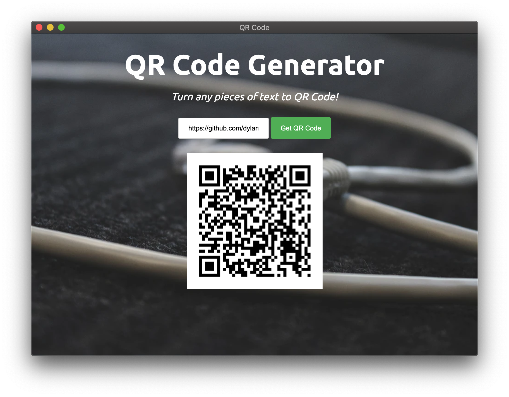

<html>
<h1>QR Code Generator</h1>
<body>
    <h2>Intro</h2>
    

    GUI apps are created by using EEL, which a little Python library with full access to Python capabilities and library
    

    
<i>The directory structure of the project is simple:</i>

    

. 
├── main.py 
├── README.md 
├── requirements.txt 
└── web 
&nbsp;&nbsp;&nbsp;&nbsp;&nbsp;&nbsp;&nbsp;&nbsp;└── index.html 
&nbsp;&nbsp;&nbsp;&nbsp;&nbsp;&nbsp;&nbsp;&nbsp;└── script.html 
&nbsp;&nbsp;&nbsp;&nbsp;&nbsp;&nbsp;&nbsp;&nbsp;└── css 
&nbsp;&nbsp;&nbsp;&nbsp;&nbsp;&nbsp;&nbsp;&nbsp;&nbsp;&nbsp;&nbsp;&nbsp;&nbsp;&nbsp;&nbsp;&nbsp;└── style.css  
    

    
<body>        
</html>
